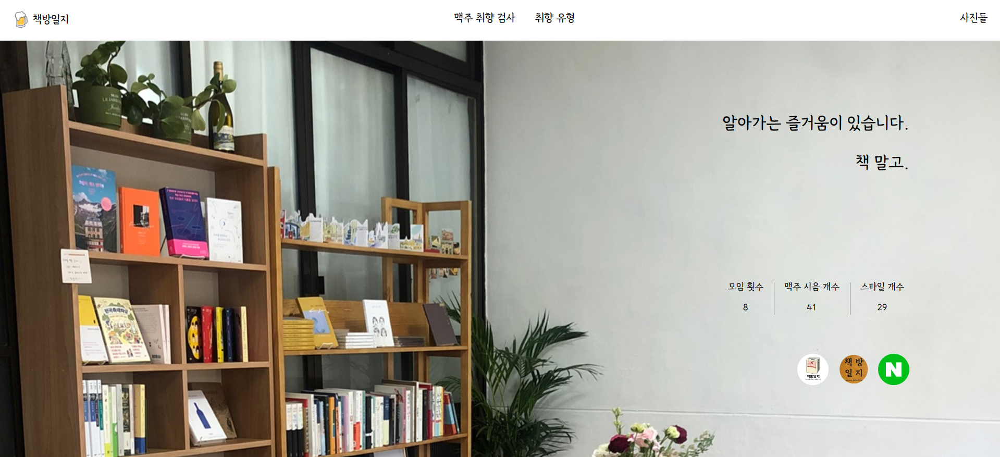

# Beer-Preference-Type

## 220626 1일차

<br>

HTML, CSS로 홈페이지 대문만 만듦

<br>


<br>

### 어려웠던 점

- 원래 좌상단에 있는 책방일지를 (주酒) 책방일지로 하고 싶었으나 body에 폰트를 집어 넣으니 해당 한자가 공백으로 나왔다.
  이를 해결하려고 한자에만 적용되는 폰트를 찾아서 쓰려 했으나 중국사이트에서 다운을 받아야 되서 찝찝해서 넘어갔다. 해결 방법은 여러 가지가 있겠지만 하드 코딩 방식으로는 하고 싶지 않고 후에 알아 보고 수정할 것 <span style='background-color:#fff5b1'><span style='color:black'>-->220628 3일차에 heigh 100vh으로 해결했다.</span></span>
- background-image를 이용해 책방일지 배경을 넣었다. 다른 컴퓨터 화면으로 보면 어떻게 변경될지가 가장 신경쓰이는 포인트.

<br>

---

<br>

## 220627 2일차

<br>

홈페이지 대문 완성 -링크 추가 <br>
JS를 이용해서 navbar 스크롤 위치에 따라 스타일 변경 적용

<br>


<br>

### 어려웠던 점

- navbar에 position: fixed를 사용하니 navbar가 사라지는데 그 이유를 몰라 한 동안 고생했다.

- 해결법은 z-index:1 을 주는 것으로 해결. main보다 우선 순위가 떨어져서 main img 뒤에 위치해서 사라졌던 것으로 파악

<br>

---

<br>

## 220628 3일차

<br>

- 홈페이지 대문에 있는 '맥주 취향 검사' 버튼에 애니메이션 추가
- CSS를 이용해서 사용자 디스플레이 화면에 맞게 배경 이미지 세팅 - <span style='background-color:#fff5b1'><span style='color:black'>1일차 문제 해결</span></span>
- JS를 이용해서 '맥주 취향 검사' 버튼을 누를 경우 qna 페이지로 이동 기능 추가

<br>




<br>

<center>짜잔 없었는데 있었습니다!</center>

<br><br><br><br><br>

```javascript
const first_page = document.querySelector("#first_page");
const qna = document.querySelector("#qna");

const start = () => {
  first_page.style.WebkitAnimation = "fade_out 1s";
  first_page.style.animation = "fade_out 1s";
  setTimeout(() => {
    qna.style.WebkitAnimation = "fade_in 1s";
    qna.style.animation = "fade_in 1s";
    setTimeout(() => {
      first_page.style.display = "none";
      qna.style.display = "block";
    }, 400);
  }, 400);
};
```

<br>

css에 애니메이션 키프레임을 넣고 html 해당 id들을 가져와서 변수로 넣은 다음, style.display로 none과 block을 나타내다가 너무 급작스럽게 페이지가 넘어가서 setTimeout을 썼다.

<br>

### 어려웠던 점 && 고민

- 어려웠다기 보다는 기껏 만들었던 스크롤 움직임에 반응하는 js가 스크롤을 없애면서 무용지물이 되어버려 그게 좀 슬펐다. (사용자 디스플레이 맞춤 css)

- CSS에서 글로벌 단위로 일괄적으로 적용시키던 코드를 어디에 넣을지 고민을 했는데 작업하는 중에는 모든 CSS 파일에 다 넣어 놓는게 좋을 것 같다. 그래야 속성값에서 자동 생성이 되면서 작성이 용이하다. 작업이 끝나고는 style.css 제외하고 나머지에는 다 삭제하면 될 듯.

- 핸드폰 화면으로 볼 경우 예상대로 정렬이 다 흐트러지고 글도 배경 때문에 잘 안 보인다. 반응형으로 작업해야 되겠다.

<br>

---

<br>

## 220629 4일차

<br>

- '맥주 취향 검사'의 안내 페이지 완성 'qna_guide'
- '맥주 첫 설문 페이지' 레이아웃 및 내용 90% 완성 (맥주 이미지에 마우스를 갖다 댈 경우 해당 맥주의 간략한 설명 추가 예정) 'qna_question'
- 안내 페이지에서 첫 설문 페이지로 넘어가는 JS 완성 (DRY! 고민)

<br>


<br>

<br>

### 어려웠던 점 && 고민

- 위에서도 설명했 듯 페이지 이동 버튼이 사실상 재사용되었다. 찝찝한 코드... 수정 필요

- 오랜만에 만져서 그런지 콘텐츠 중앙 정렬이 쉽지 않았음 - 해결 방법은 absolute를 줘서 top, left에 50%을 주고 translate(-50%, -50%)를 줘서 스스로를 기준으로 -50%만큼 이동시켜서 맞췄다. 이것 말고도 다른 방법이 4가지 정도 있던데 링크 [참고](https://oursmalljoy.com/css-%EA%B8%80%EC%9E%90-%EC%88%98%EC%A7%81-%EA%B0%80%EC%9A%B4%EB%8D%B0-%EC%A0%95%EB%A0%AC-text-vertical-align/)

<br>
